# DoubleD MIDI Joystick

  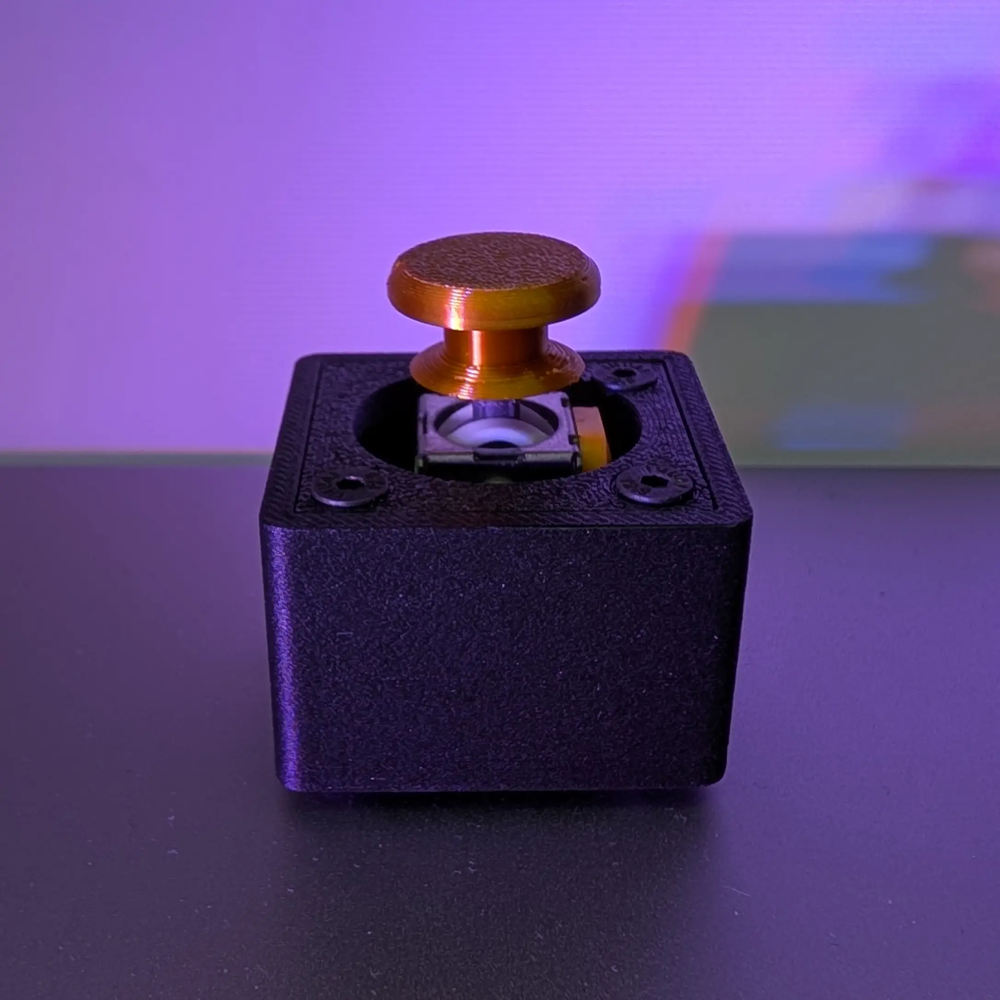
  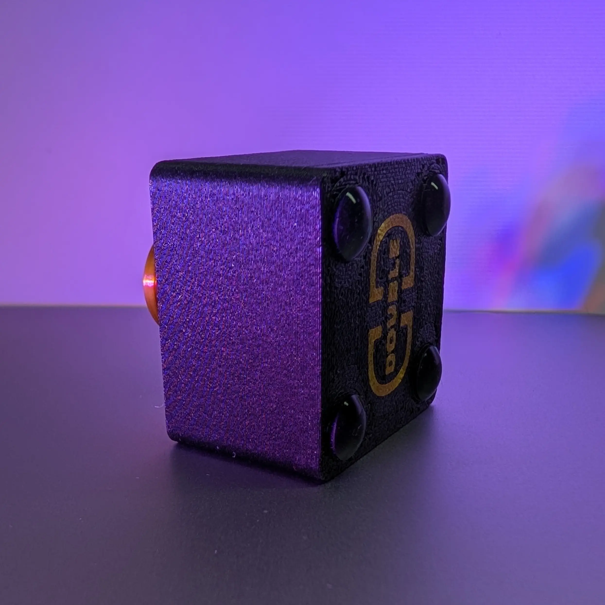

  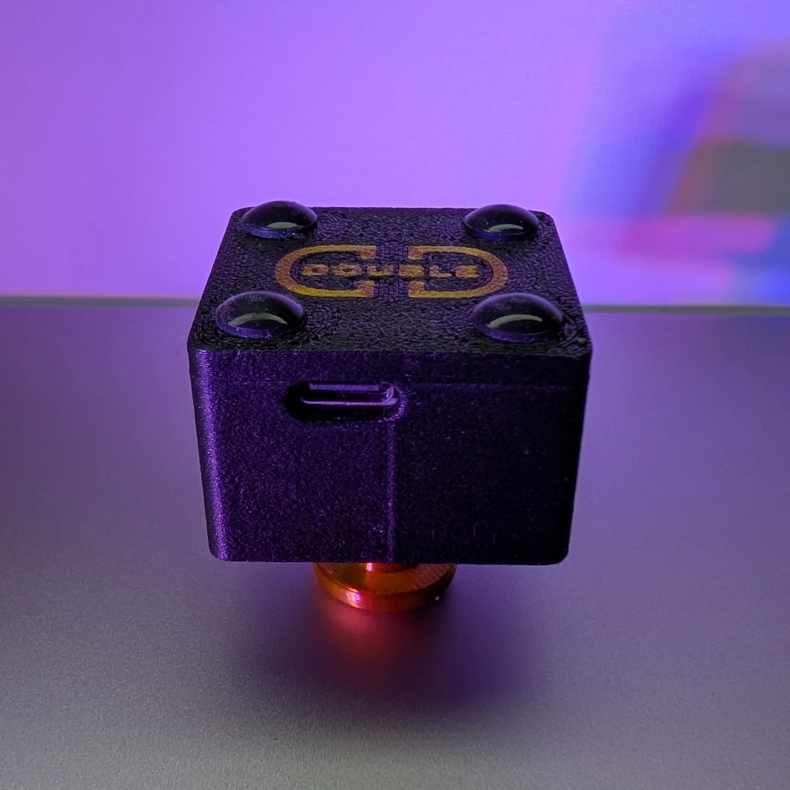
  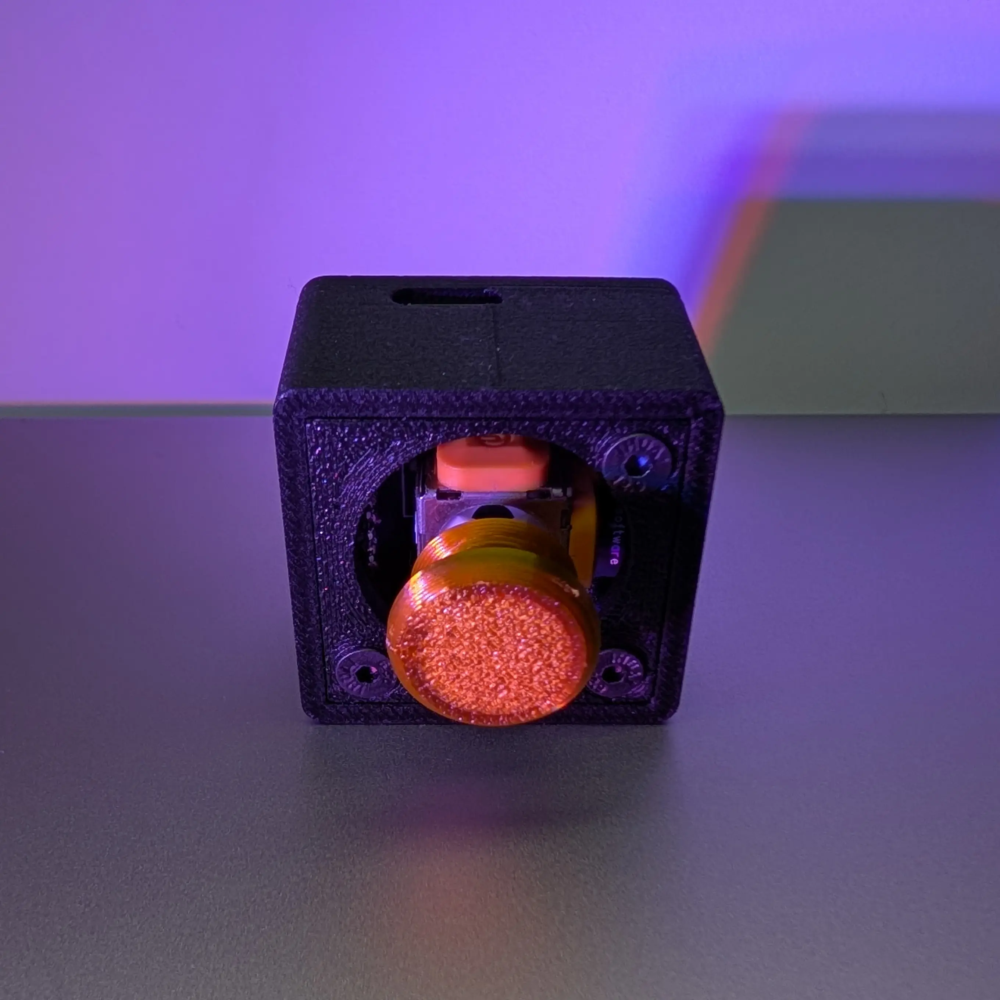

The MIDI joystick was designed to work with stage lighting equipment to intuitively control
moving heads and their positions. As commercial options weren't readily available or were very expensive,
the DoubleD stick was designed with available and simple components. To ensure high precision while positioning,
a hall effect joystick was used instead of a resistance based one. 

Looking for the build guide? Jump to the [Build Your Own section below](#build-your-own)!

## Idea
The idea was to use a hall effect joystick replacement for the PlayStation 5 as they are often
available for very cheap and their footprints are available for use in PCBs as well. They also feature a
small footprint and are easy to interface with as they simply output a voltage (like the regular ones do)
with all the benefits of a hall effect sensor.

Originally, a 16-bit ADC was planned to provide higher precision when compared to the S3's 12-bit ADC.
However, after considering MIDI's 7 bits of available data which only go up to a max value of 127, the
difference between 12 bits and 16 bits is negligible. Although MIDI also defines a 14 bit value, many 
lighting programs don't support these types of values. Further testing has also shown that 128 different values
are enough to have reasonable precision, as the joystick's range of motion isn't very large.

The Espressif S3 Supermini was set to serve as the brain of the operation as it supports USB MIDI output.
While there are cheaper and certainly less powerful microprocessors out there, it was what we had on hand
and the devboard-nature of the Supermini allowed for a custom PCB built around the SoC itself to be skipped in 
favor of a very simple PCB.

The PCB itself should be very simple and only contain the correct footprint for the replacement joystick
and a few pins to mount the S3 board directly beneath the joystick, allowing for a small size. As the S3 has 
the required pins on one side, only that row of pins has to be connected to the PCB. The rigidity of the solder
then holds the board in place.

The device should be housed in a 3D-printed case with a main housing and a lid to firmly secure the PCB and the
attached S3 board with screws and embedded square nuts.

## Prototype

  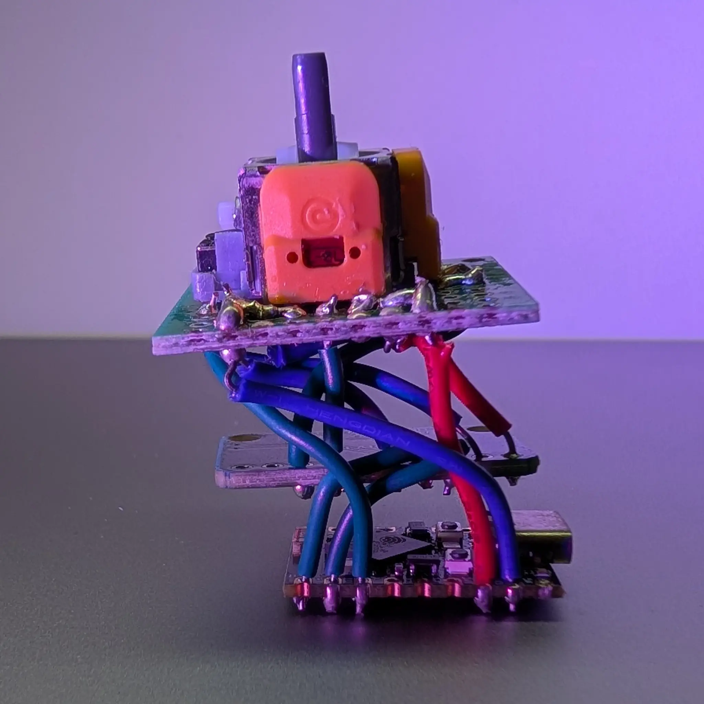
  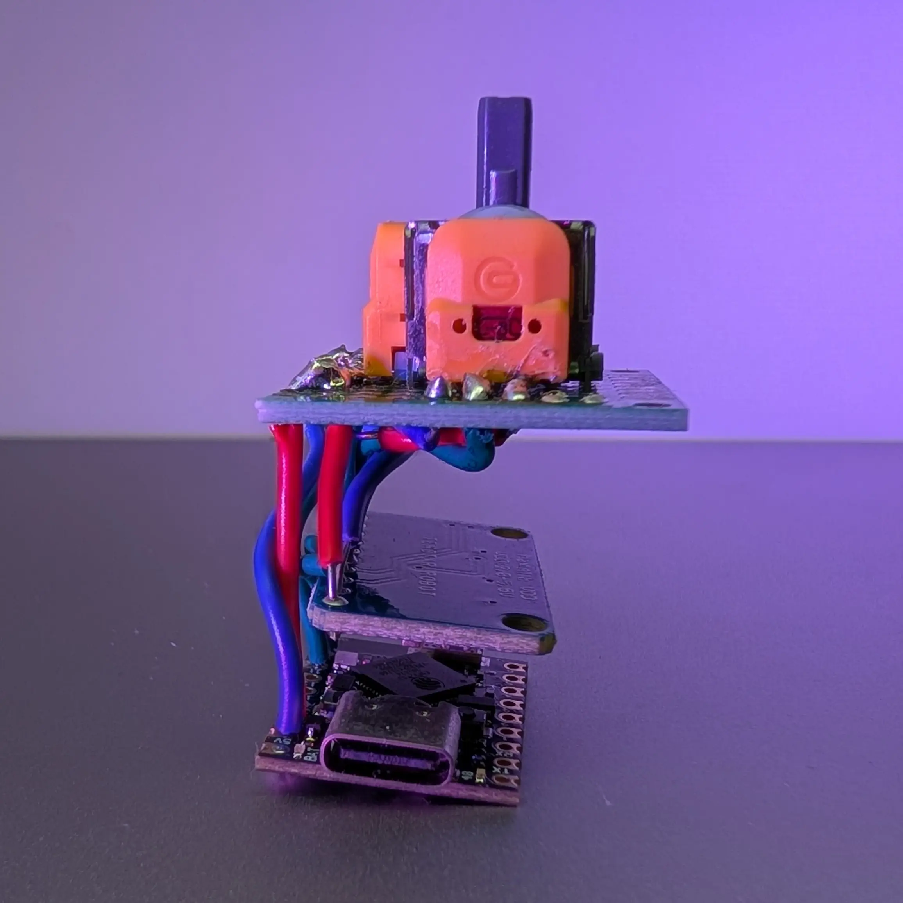

The prototype featured the aforementioned 16-bit ADC and a perfboard on which the joystick is soldered to.
The pins of the joystick module had to be bent in place in order to fit into the grid pattern of the perfboard.
After creating a calibration and a separate regular use program, the device's function was verified.
The prototype proved to be a success, and the idea was to use the S3 Supermini devboard as it is and design a PCB
that would contain the correct footprint for the joystick module and the 16-bit ADC. Further research however showed,
that the S3's 12-bit ADC resolution would be enough, and without testing the S3's ADC directly, the PCB went into production without
the ADC, making it an extremely simple board.

## PCB

  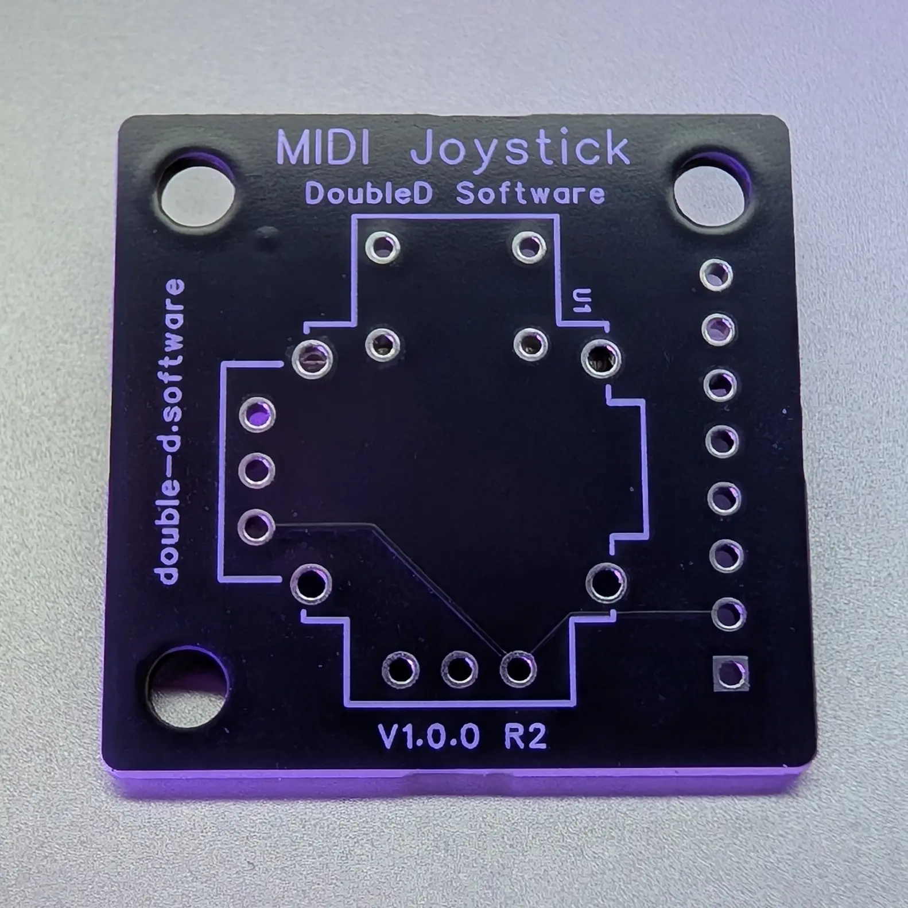
  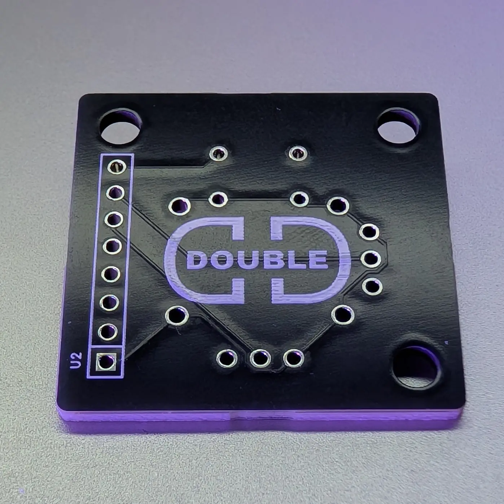

As previously mentioned, the PCB is as simple as it gets. It only connects the S3 and the joystick module in the 
correct order. The dimensions of the PCB are 30,226 mm x 29,464 mm (width x height) making it slightly not square.
These specific dimensions serve no actual functional purpose and were arbitrarily set for reasons I don't remember.
The board only has two layers and is thus cheap to produce through services like JLCPCB. The black silkscreen also
looks quite good.

The Gerber files and the EasyEDA project files (`.epro2`) can be found in the `3dfiles` directory.
The STEP file `DoubleD MIDI Stick.step` not only contains the case, but also the S3 Supermini and a 3D model of the PCB.

## Software
Originally, the software for the device was written in the Arduino IDE with bleeding edge USB MIDI support in the Arduino
library. The program was split into two sketches: the calibration and the MIDI sketch. The calibration simply ran a
calibration procedure which configured the max and min values for the two axes as well as the center position and
deadzone. It the printed these values to the serial console and were copied into the MIDI sketch as global constants.
That sketch was then flashed and used in regular day-to-day use. After a while, the need for a 
"continous send mode" which always sent the current position of the stick regardless of whether the position has
changed or not. This mode was activated by pressing the joystick button.

This new and improved control software combines the calibration and the MIDI sketch and uses a hybrid approach
when it comes to continously sending MIDI updates. After the first flash of the software, an immediate calibration
procedure is launched which stores the results in the EEPROM of the S3. This removes the step of copying the 
calibration data over to another sketch. It also means that the device can always be recalibrated without reflashing
the software. The joystick now sends regular MIDI updates when the position of the joystick isn't in the center (every
50 ms, configurable though) and an update every ten seconds when the stick is in its center position. To improve fine 
control near the joystick's center position, the input is mapped through a response curve. This makes small movements 
around the center less sensitive while preserving faster changes near the outer range.

An optional serial mode is implemented as well which makes debugging easier. In order to activate the simultaneous 
serial mode, hold the joystick button while plugging the device in. It should then register as a MIDI and as a serial device,
logging calibration data to the serial console.

The SoC is set to clock at 80 MHz which reduces the power consumption to roughly 70 mW.

## Calibration
The calibration is automatically started after the first flash. If you wish to recalibrate, do the following set of steps.

| Procedure              | Description                                                                                                                                                                                                                                                                                                                                                                                         |
|------------------------|-----------------------------------------------------------------------------------------------------------------------------------------------------------------------------------------------------------------------------------------------------------------------------------------------------------------------------------------------------------------------------------------------------|
| Calibration Initiation | Disassemble the device and press and hold the `BOOT` button for five seconds. While holding, a yellow light should start blinking. After the five seconds have elapsed, the light should flash green. Let go of the button. It will now calibrate the center position.                                                                                                                              |
| Center Positioning     | DO NOT touch the stick while it is calibrating its center position! The device measures many samples of the center position and then uses the  average as the center position and stores the measured deadzone along with it. The yellow light should blink during this procedure. After the procedure has been completed, the light should flash green. It will now calibrate the range of motion. |
| Range of Motion        | Move the stick to all extremes in order for the joystick to register its maximal range of motion. Do this multiple times. If you're done, press the joystick button and the procedure is complete. The yellow light should blink during this procedure. The light should flash green again.                                                                                                         |

On every subsequent startup of the device, the light should blink green once to signal correct calibration data. Should
the saved calibration data ever be invalid or corrupted, an automatic calibration is started. Should the calibration
data turn out to be invalid after completing the calibration procedure, the light will flash red to signal an error.
Unplug and replug the device from USB power and try again. Should the light again flash red, a hardware failure
might have occurred.

## Visualizer
To verify the function of the joystick, a web visualizer is hosted at https://doubled-software.github.io/MIDI-Stick.
Your browser has to have WebMIDI support. The website will show the current joystick position in 2D space and as 
numeral values.

## Files
| File in `3dfiles`                | Description                                                                                                                                                                                    |
|----------------------------------|------------------------------------------------------------------------------------------------------------------------------------------------------------------------------------------------|
| DoubleD MIDI Stick.3mf           | This contains the two case parts and a modified version of the thumbstick from [this MakerWorld page](https://makerworld.com/en/models/553798-playstation-5-ps5-controller-thumbstick).        |
| DoubleD MIDI Stick.step          | This file contains the entire 3D model of the device, which also includes a model of the S3 Supermini, the PCB and the header pins connecting them, as well as a model of the joystick module. |
| DoubleD MIDI Stick.epro2         | This contains the EasyEDA project files for the PCB.                                                                                                                                           |
| DoubleD MIDI Stick - Gerbers.zip | The Gerber files to directly upload to a PCB manufacturer's online order form.                                                                                                                 |
| DoubleD MIDI Stick - Lid.step    | The 3D model of the lid in STEP format.                                                                                                                                                        |
| DoubleD MIDI Stick - Lid.stl     | The same 3D model but in STL format.                                                                                                                                                           |
| DoubleD MIDI Stick - Logo.step   | A 3D model of the DoubleD logo in STEP format.                                                                                                                                                 |
| DoubleD MIDI Stick - Logo.stl    | The same 3D model but in STL format.                                                                                                                                                           |
| DoubleD MIDI Stick - Shell.step  | The 3D model of the shell in STEP format.                                                                                                                                                      |
| DoubleD MIDI Stick - Shell.stl   | The same 3D model but in STL format.                                                                                                                                                           |

# Build Your Own
## BOM
| Part         | Qty | Description                                                                                                                                                                                                       | Link to Purchase                                                                        |
|--------------|-----|-------------------------------------------------------------------------------------------------------------------------------------------------------------------------------------------------------------------|-----------------------------------------------------------------------------------------|
| PCB          | 1   | Upload the Gerber file in the `3dfiles` directory to a PCB manufacturer of your choice.                                                                                                                           |                                                                                         |
| S3 Supermini | 1   | It is important that you buy the S3 Supermini and not the C3 as they look very similar. Pay attention to the title of the listing. The header pins used to connect the S3 to the PCB are included in the package. | [Link](https://de.aliexpress.com/item/1005007128360025.html)                            |
| Case Shell   | 1   | The case shell. It is provided as a STEP and as an STL file. The shell is also included in the provided 3MF.                                                                                                      |                                                                                         |
| Case Lid     | 1   | The lid that closes the shell after the device has been inserted into it. It is also available as STEP and as STL. It is also included in the provided 3MF.                                                       |                                                                                         |
| Thumbstick   | 1   | Download it from the MakerWorld page and modify it yourself, or use the one provided in the 3MF.                                                                                                                  | [Link](https://makerworld.com/en/models/553798-playstation-5-ps5-controller-thumbstick) |
| Screws       | 3   | DIN 7991 countersunk screws, M3 and 20 mm in length.                                                                                                                                                              | [Link](https://de.aliexpress.com/item/4001199728978.html)                               |
| Square Nuts  | 3   | DIN 557 square nuts, M3 and max width of 5,8 mm and a max height of 2,5 mm.                                                                                                                                       | [Link](https://de.aliexpress.com/item/1005011761193639.html)                            |
| Cable        | 1   | Either a USB-C to USB-C or a USB-C to USB-A cable as the S3 Supermini only has a USB-C port.                                                                                                                      |                                                                                         |

> [!NOTE]
> Some of the provided links may not work currently or are not available in your region. Try to find the best alternative.

## 1. Electronics Assembly

  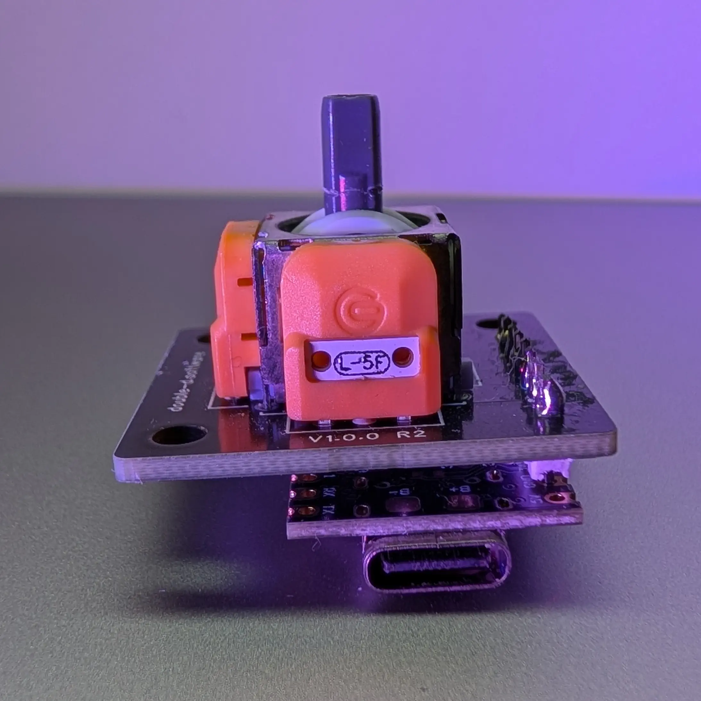
  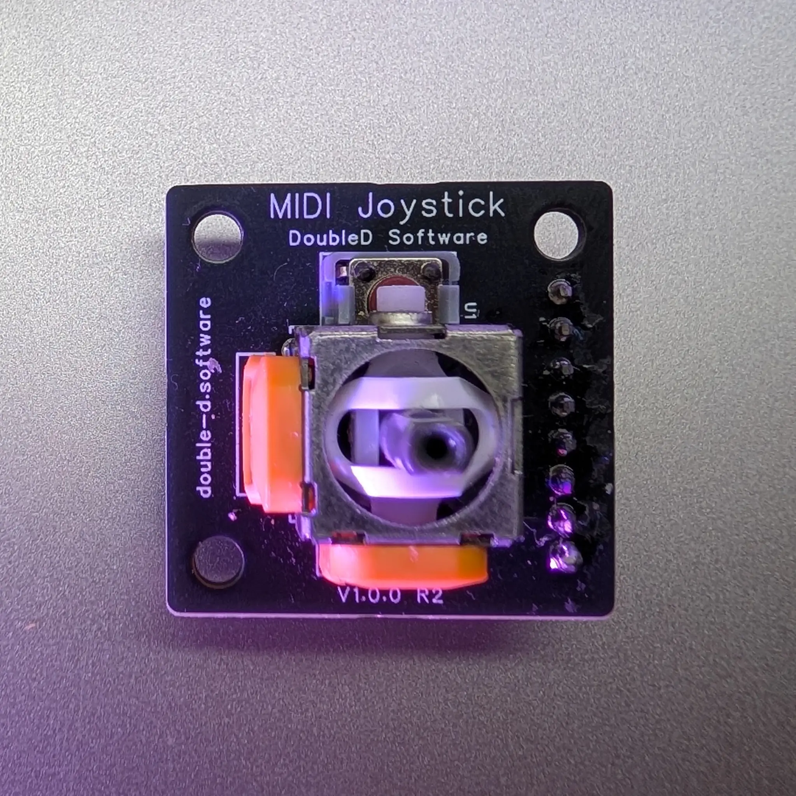
  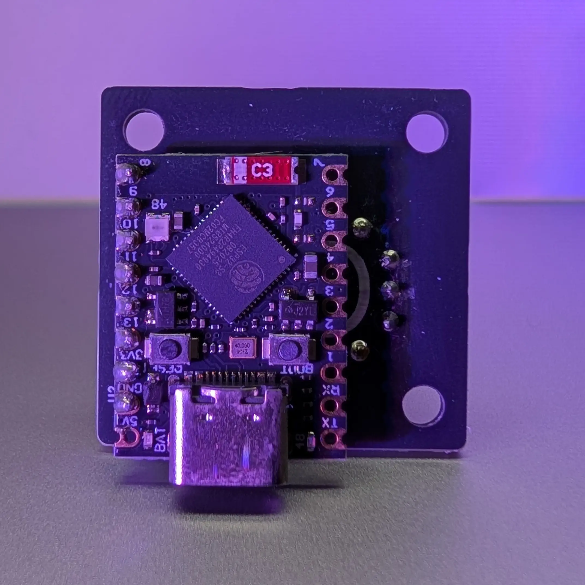

1. Solder the joystick to the PCB.
2. Solder the S3 Supermini to the bottom of the PCB with the provided header pins.
3. Done!

Make sure that you cut off one pin of the header pins and skip the pin closest to the USB-C port. It is not used
and allows the S3's USB-C port to be accessed with the case on! Also verify the correct orientation of both the joystick
module and the S3. The joystick module should be soldered to the side with the joystick outline and the S3 should be soldered
on the opposite side.

## 2. Flashing
1. Clone the repository. `git clone https://github.com/DoubleD-Software/MIDI-Stick`
2. Install PlatformIO. https://platformio.org/install
3. Hold `BOOT` and connect the S3 to your computer. Alternatively, connect first and then hold `BOOT` and briefly press `EN`
simultaneously.
4. Flash the software. `pio run -t upload`
5. As this is the first time the software is flashed, it will automatically start to calibrate. Wait until the light
blinks green twice. It should then blink yellow again. The software will then measure the max and min values of both
axes, so move the stick accordingly to all extremes. When done, press the joystick button. The light should flash green again, 
and then the calibration is done!
6. Verify function with the [web visualizer](https://doubled-software.github.io/MIDI-Stick).

If you ever want to calibrate your stick again, look at the [calibration procedure](#calibration).

## 3. Assembly

  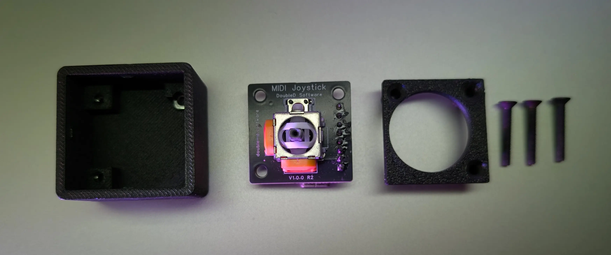

  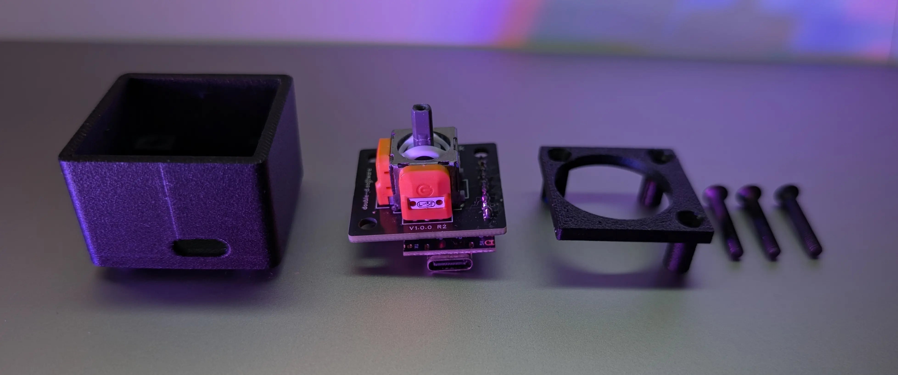

  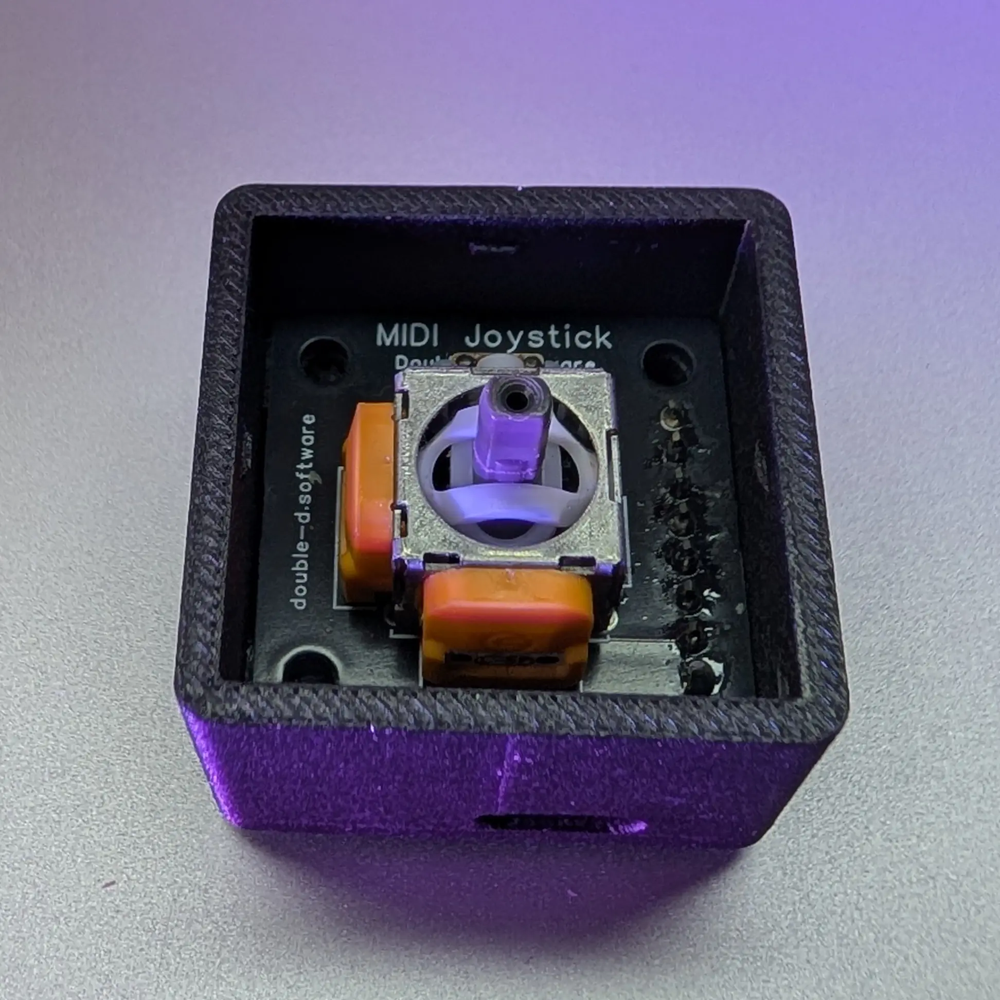
  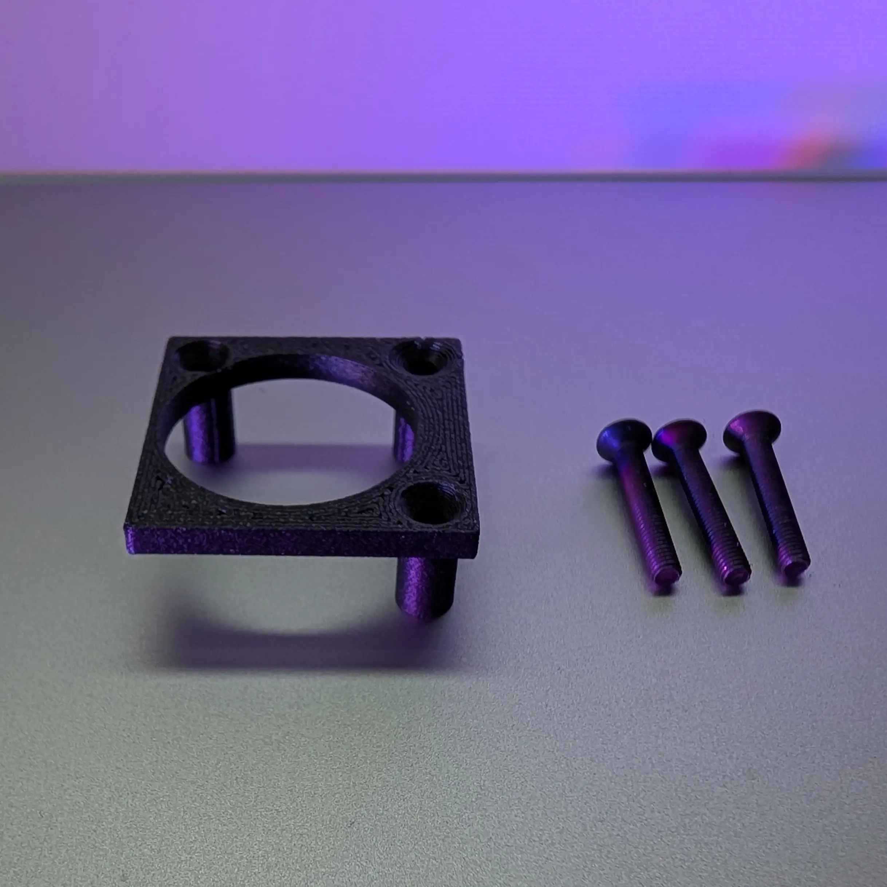

  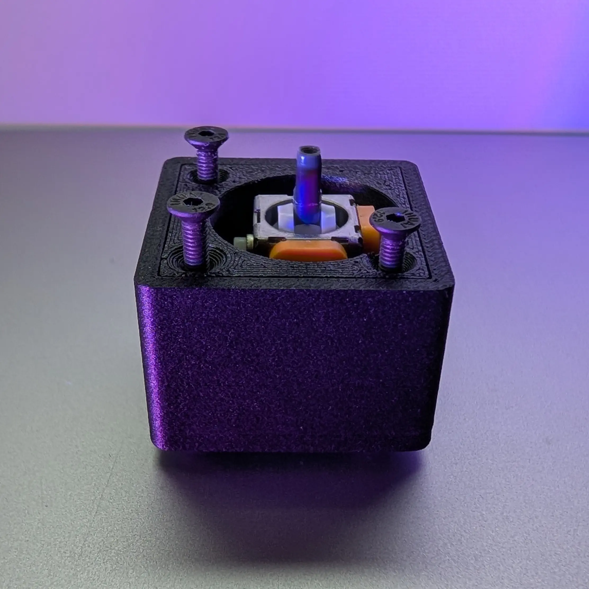
  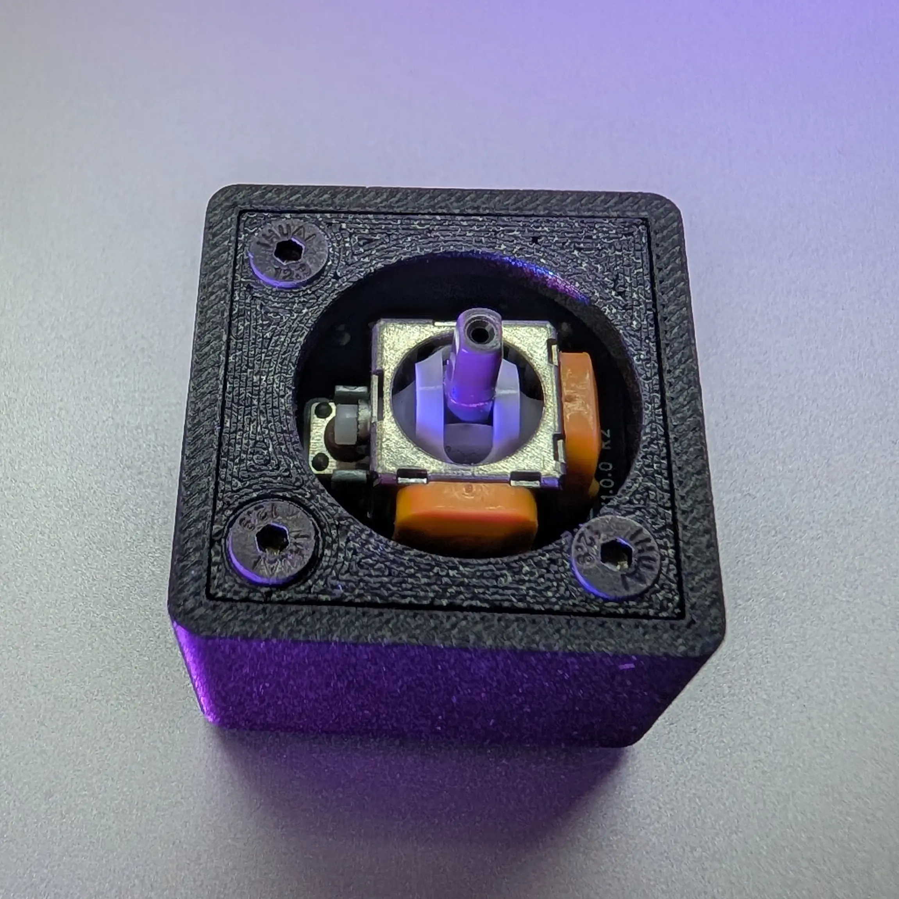

> [!WARNING]
> Before assembling, make sure you have flashed the software and calibrated the stick!
 
1. Insert the three square nuts in their designated pockets. The lowest nut doesn't sit very tight so be careful
when moving the case around while not yet assembled.
2. Put the electronics assembly in at an angle, then straighten it once the hole for the USB-C port has been reached.
The electronics package should then sit firmly in place and the PCB should be parallel to the rest of the case.
3. Place the top lid on top of the PCB and align the holes. The lid can only be placed one way.
4. Screw in the three screws.
5. Put on the thumbstick.
6. Done!

You should now have a working DoubleD MIDI Joystick in your hands! Verify with the [web visualizer](https://doubled-software.github.io/MIDI-Stick).

---

### Licensing
- Software and firmware are licensed under GPL-3.0-or-later.
  - `/src`
  - `/include`
  - `/docs` (the web visualizer)
  - **License file:** `LICENSE`
- Hardware design files, including PCB layouts, schematics,
  Gerbers, 3D models, STEP files, STL and manufacturing files,
  are licensed under CERN-OHL-S v2.
  - `/3dfiles`
  - **License file:** `/3dfiles/LICENSE`